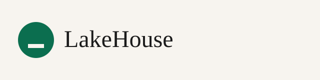

# Template-OpenSource

<!-- AUTO:header -->
<picture>
  <source media="(prefers-color-scheme: dark)" srcset="docs/media/logo-dark.svg" />
  
</picture>
<!-- /AUTO:header -->

**LakeHouse Studio** publishes open-source AEC tooling templates so architecture and engineering teams can ship Revit, Rhino, Grasshopper, InDesign, and BIM utilities with OpenSSF-aligned CI, changesets-based releases, Starlight docs SEO, and zero-cost GitHub Free runners — without client data, without `*.github.io` as the public hostname, and with a brand-stable `@lakehouse` package scope for design-tools automation.

⚠ TEMPLATE — starter for the **LakeHouse** brand (org identity: [`.lakehouse/org.json`](./.lakehouse/org.json)). Projects created from this template should use a **plain repository name** (no `Template-` prefix).

<!-- AUTO:badges -->
[](./docs/org.md)
[](./docs/org.md)
[](./LICENSE)
[](./docs/org.md)
<!-- /AUTO:badges -->

<!-- AUTO:toc -->
- [About](#about)
- [Quick start](#quick-start)
- [Releasing](#releasing)
- [Discoverability](#discoverability)
- [Agent rules](#agent-rules)
- [Contributing](#contributing)
- [Security](#security)
- [License](#license)
<!-- /AUTO:toc -->

## About

<!-- AUTO:repo-meta -->
| | |
| --- | --- |
| Brand | `LakeHouse` |
| Package scope | `@lakehouse` |
| Public domain | `REPLACE_WITH_CUSTOM_DOMAIN` (set a real custom domain in org.json — never assume a hostname; never `*.github.io`) |
| GitHub owner | runtime: `github.repository_owner` or `.lakehouse/org.json` `orgName` |
| Repository | `Template-Widget` |
| Tier | `public` |
| License | `pending` (suggested: Apache-2.0) |
| Code owner | [@zsenarchitect](https://github.com/zsenarchitect) |
| Runners | GitHub-hosted only |
| Merge style | Merge commits only |
| Releases | changesets → CI `vX.Y.Z` tag → draft GH release + npm OIDC |
| Action pins | [`.lakehouse/pins.json`](./.lakehouse/pins.json) |
| Org runbook | `{owner}/.github` (see [docs/org.md](./docs/org.md)) |
<!-- /AUTO:repo-meta -->

See [docs/discoverability.md](./docs/discoverability.md) for the GitHub description/topics standard and [site/](./site/) for the Starlight docs scaffold (dark mode, accent `#7DFFFF`).

## Quick start

```bash
npm install
npm run hooks:install
npm run readme:gen
npm run citation:gen
npm run check:all
cd site && npm ci && npm run build
```

## Releasing

Changesets → CI version PR → CI-only `vX.Y.Z` tag → build, checksums, provenance attestations → **draft** GitHub Release → npm OIDC trusted publishing.

Regular releases help GitHub ranking — see [docs/releasing.md](./docs/releasing.md).

- [docs/pre-release-checklist.md](./docs/pre-release-checklist.md)
- [docs/seo-launch-checklist.md](./docs/seo-launch-checklist.md)
- [docs/rollback.md](./docs/rollback.md)
- Media: [docs/media/](./docs/media/)

## Discoverability

- Standard: [docs/discoverability.md](./docs/discoverability.md)
- Org profile / pins strategy: [docs/org-profile.md](./docs/org-profile.md)
- Awesome lists: [docs/awesome-lists.md](./docs/awesome-lists.md)
- Sen SEO verification + GoatCounter: [docs/sen-seo-verification.md](./docs/sen-seo-verification.md)
- CI: `npm run check:discoverability`

## Agent rules

See [AGENTS.md](./AGENTS.md) (imported by [CLAUDE.md](./CLAUDE.md)).

## Contributing

See [CONTRIBUTING.md](./CONTRIBUTING.md) for DCO sign-off and the stacked-PR merge-commit workflow.

## Security

See [SECURITY.md](./SECURITY.md).

## License

<!-- AUTO:license-notice -->
License is **pending** owner selection. Suggested default: [Apache-2.0](https://www.apache.org/licenses/LICENSE-2.0). See [docs/license.md](./docs/license.md).
<!-- /AUTO:license-notice -->
