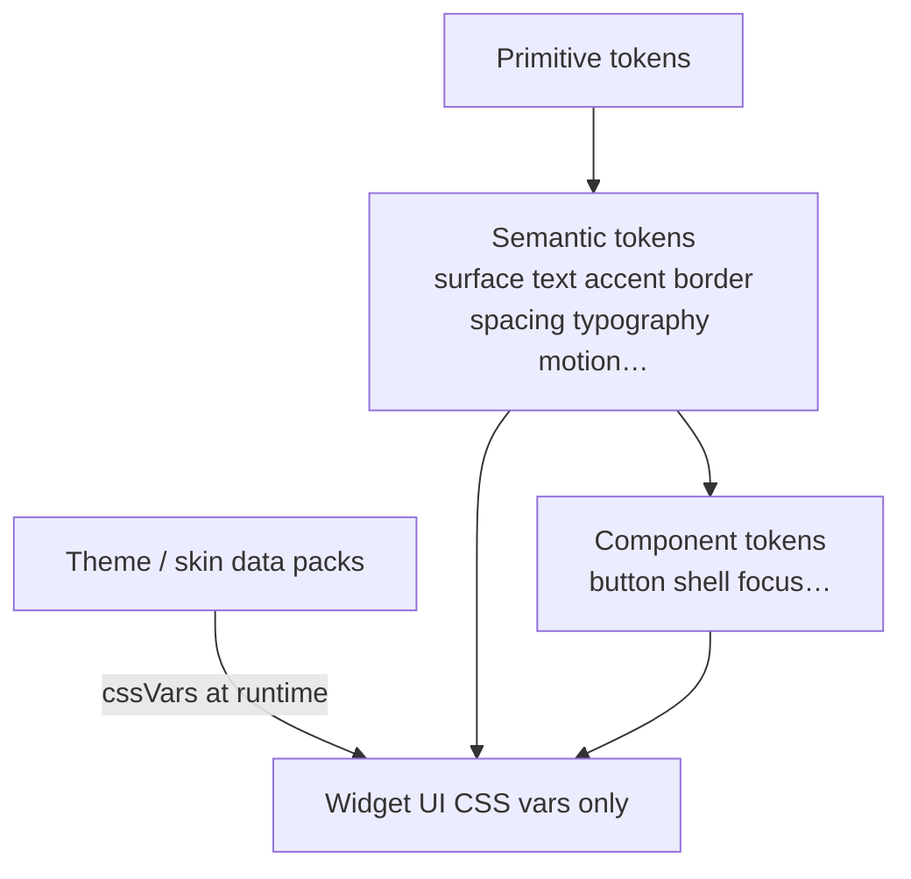

# Design contract (widget side)

LakeHouse desktop lets each user **reskin the entire UI**. The design system is a versioned **contract**, not a fixed look. Canonical package (monorepo): `@lakehouse/design-contract`. This template depends on a **placeholder stub** until that package publishes — **do not vendor** it.

Org companion (when published): `{owner}/.github` → `docs/architecture/design-contract.md`.

## Layers



| Layer | Who writes values | Who consumes |
| --- | --- | --- |
| Primitive → semantic → component | `@lakehouse/design-contract` (DTCG JSON → CSS/TS; Rust later for Tauri) | Host + widgets |
| Theme / skin pack | `theme.json` (+ optional assets), SemVer’d against the contract | Host injects into sandbox |
| Widget / app UI | **Never** raw hex/px/font — only `var(--…)` semantic/component tokens | `src/`, `apps/site/`, `preview/` |

## Default theme vs skins

- **LakeHouse Studio** (default skin only): brand kit v0.3 graphite ramp (`#161616` sunken through `#383838` overlay), canvas `#1E1E1E`, accent `#7DFFFF`, **Geist** + **Geist Mono**. Brand/marketing stays dark-only. Canonical kit: `{owner}/.github/brand/`.
- **Lake Morning** (example skin): light pack proving a full reskin with **no rebuild**.
- User skins may be anything (including light). Agents generate skins the same way as widget overlays.

## Widget manifest

`widget.json` → `engines.designContract` is a SemVer range (this template: `>=0.1.0 <1.0.0`).  
`customization.themeTokens` maps overlay keys onto **semantic CSS variable names** (e.g. `"accent": "--color-accent"`). Concrete overrides in overlays are applied as CSS variables by the host/widget bridge.

## Host injection

The host (and this repo’s mock preview) applies the active theme’s CSS variables, then optional overlay overrides, then the widget mounts. Preview: theme select switches **LakeHouse Studio** ↔ **Lake Morning** via `host.theme` postMessage.

## Enforcement (this repo)

| Check | Command | Behavior |
| --- | --- | --- |
| No hardcoded colors/sizes/fonts in widget UI | `npm run check:hardcoded-values` | Fail |
| Contract range + default contrast | `npm run check:design-contract` | Fail if default &lt; 4.5:1; **warn** on example skins |

## Agent guidance — make a skin

1. Copy a theme pack shape from `stubs/design-contract/themes.js` (or the published package themes).
2. Fill semantic + component CSS variables; keep `contractVersion` inside the widget’s `engines.designContract` range.
3. Prefer shipping the skin as host/user data (overlay / theme id), not a fork.
4. Run `npm run check:design-contract` and preview with `?theme=<id>` / the preview theme select.
5. Do **not** expand `stubs/design-contract/` into the real package.

## Stub status

```
package.json → "@lakehouse/design-contract": "file:./stubs/design-contract"
stubs/design-contract/ → TODO(design-contract) placeholder version 0.0.0-placeholder.0
```

Replace with the published package when Template-Monorepo ships it.
