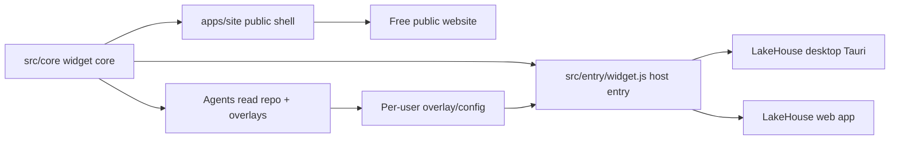

# Dynamic UI/UX — three modes, one codebase

A public widget repo (for example a **PDF markup tool**) must work in three ways from **one** codebase:

| Mode | Path | Who |
| --- | --- | --- |
| **1. Standalone public website** | `apps/site` + `dist/standalone.js` | Attracts users; deploy on Vercel free or Pages + custom domain |
| **2. In-app widget** | `dist/widget.js` + `widget.json` | Loaded into LakeHouse desktop (Tauri) and web app |
| **3. Agent reference** | repo + `customization` + `overlays/` | Desktop agents read the contract to generate **per-user** customizations |

## Example: PDF markup tool

Imagine this template specialized into a public **PDF markup** widget:

1. **Website** — `apps/site` is a free markup demo (same core). Marketing chrome stays in the shell; drawing/tools live in `src/core`.  
2. **LakeHouse apps** — the office loads `dist/widget.js` in a sandboxed iframe/web component; host enforces permissions.  
3. **Per-user dynamic UI** — an agent reads `widget.json` customization points and writes an overlay so *Alice* gets a redaction-heavy toolbar and no sidebar, while *Bob* gets measurement tools and export enabled — **without forking** the repo. Fork only if someone needs a new engine or backend.

Concrete overlay demo in this template: [`overlays/example.user.json`](../overlays/example.user.json) via `apps/site/?overlay=example`.

## Layout in this template

| Path | Role |
| --- | --- |
| `src/core/` | Shared widget core (mount, styles, overlay merge) |
| `src/entry/widget.ts` | Host entry → `dist/widget.js` |
| `src/entry/standalone.ts` | Public-site entry → `dist/standalone.js` |
| `apps/site/` | Thin standalone web shell |
| `overlays/` | Example / per-user overlays |
| `preview/` | Mock LakeHouse host for local embed testing |
| `widget.json` | Contract + **declared customization points** |

See [customization.md](./customization.md) and [widget.md](./widget.md).
